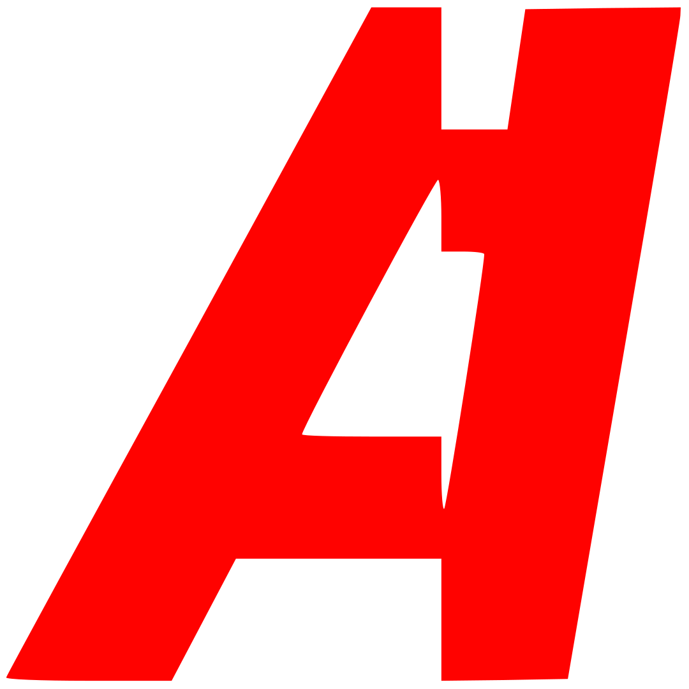
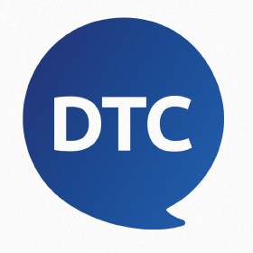

# Ramsi Kalia | MBA, MSc.

## ⚙️ Specialties: Computer Vision · PyTorch · GenAI Pipelines · AWS Networking · Agent Systems · RAG · MCP

Hi, I’m Ramsi. A research-aware AI engineer with a dual background in strategy and engineering.  
I build practical, production-grade tools across agent systems, cloud-native ML, and computer vision.

I'm currently exploring:  
→ **MCP-compliant pipelines** for safer GenAI deployment  
→ **LLMOps architectures** with advanced RAG memory and agentic planning  
→ **Cloud-based orchestration** of multimodal systems (AWS, VPCs, Discord bots)

⚡ Open to senior AI engineering roles or collaborations in GenAI deployment, agent systems, or MLOps infrastructure.

📫 You can reach me via [LinkedIn](https://www.linkedin.com/in/ramsikalia/)

---

|                                       | Project                                                                                                           | Description                                                                                                                                            | Tags                                          |
| ------------------------------------- | ----------------------------------------------------------------------------------------------------------------- | ------------------------------------------------------------------------------------------------------------------------------------------------------ | --------------------------------------------- |
|  | **albumentations-mcp** _(private repo)_                                                                           | Natural language image augmentation via MCP. Build safe, auditable pipelines with Albumentations and hook-based validation.                            | `Vision` `MCP` `Tooling` `NLP`                |
|   | **discord-mcp** _(private repo)_                                                                                  | MCP-compliant server for AI-based Discord automation. Includes tool registry, SQLite persistence, and natural language entity resolution.              | `MCP` `Discord` `SQLite` `Automation`         |
|             | **mlops-text-summariser** [repo](https://github.com/Ramsi-K/mlops-text-summariser)                                | Full conversational summarization pipeline using Pegasus, MLflow, FastAPI, and Terraform. Production-ready with CI/CD and AWS deployment.              | `NLP` `MLOps` `Bootcamp` `FastAPI` `AWS`      |
|             | **networking-bootcamp enterprise-mcp deployment** [repo](https://github.com/Ramsi-K/exp-net-fundamentals-2025-Q2) | Zero-trust, multi-VPC orchestration system built for AI agent workflows on AWS. Demonstrates core networking fundamentals through real infrastructure. | `AWS` `Networking` `VPC` `ZeroTrust` `Agents` |
|             | **llm-zoomcamp** [repo](https://github.com/Ramsi-K/llm-zoomcamp)                                                  | Full-stack LLM systems training. Covers RAG, vector search, evaluation, agent tools, monitoring, and end-to-end deployment using open-source tools.    | `LLMs` `RAG` `Qdrant` `Agents` `Evaluation`   |

## 🗓 Year-long Logs

- [**300 Days of Code 2025**](https://github.com/Ramsi-K/300-days-of-code_2025):  
  Year 2 log with focus on GenAI deployment, Chatbots, RAG, LLMOps, cloud-native workflows, MCP compliance, Discord agent tooling, and AWS ecosystem.  
  `GenAI` `RAG` `LLMOps` `Cloud` `AWS` `MCP` `Discord Bots` `Tooling`

- [**200 Days of Code 2024**](https://github.com/Ramsi-K/300-days-of-code):  
  Core focus on computer vision, reinforcement learning, GANs, and graph-based neural networks.  
  `Computer Vision` `GANs` `GNNs` `PyTorch` `RL`

##

📚 _Currently studying_: AWS ML Cert · Korean B2 (KSI) · LLM Zoomcamp  
🎯 _Interests_: Vision-Language Models (SAM, CLIP), image-grounded RAG, and agent memory scaffolds

I hang out at:

- [Torc Discord](https://discord.gg/E3NXKRjErh)
- [Language Cafe Discord](https://discord.gg/kS4N58h8tn)

---

<!--
**Ramsi-K/ramsi-k** is a ✨ _special_ ✨ repository because its `README.md` (this file) appears on your GitHub profile.

Here are some ideas to get you started:

- 🔭 I’m currently working on ...
- 🌱 I’m currently learning ...
- 👯 I’m looking to collaborate on ...
- 🤔 I’m looking for help with ...
- 💬 Ask me about ...
- 📫 How to reach me: ...
- 😄 Pronouns: ...
- ⚡ Fun fact: ...
-->
